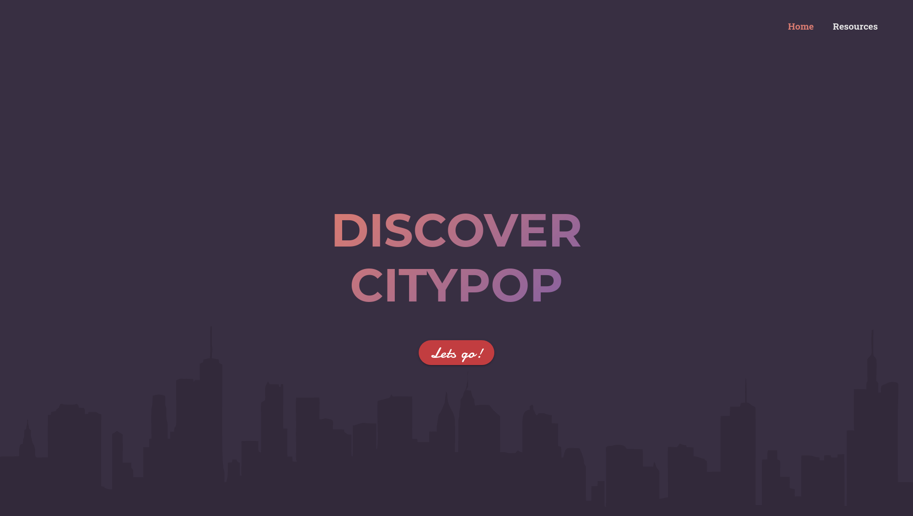

# [City Pop](https://projects.leodh.dev/citypop)

> Just a landing page made with Vue explaining the _Citypop_ music genre.

This mini project serves as a way to learn SCSS, ExpressJS and the Vuetify
component library.

## Other Documentation

- [**Frontend**](./citypop-vue/README.md)
- [**Server**](./citypop-expressjs/README.md)

## Misc

### Initial Repositories (before merge)

- [Frontend](https://github.com/leo-dh/citypop-vue)
- [Server](https://github.com/leo-dh/citypop-expressjs)
